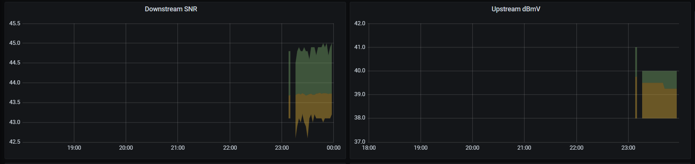

This screenscrapes the Technicolor TC4400's web interface to pull stats and saves them into influxdb

An example Grafana dashboard is given in grafana.json

To set it up, you'll need the user/password for your cable modem, the defaults are documented on https://wikidevi.com/wiki/Technicolor_TC4400

